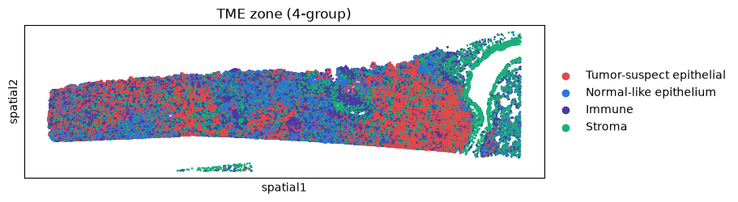
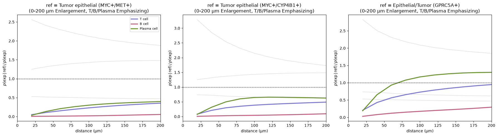
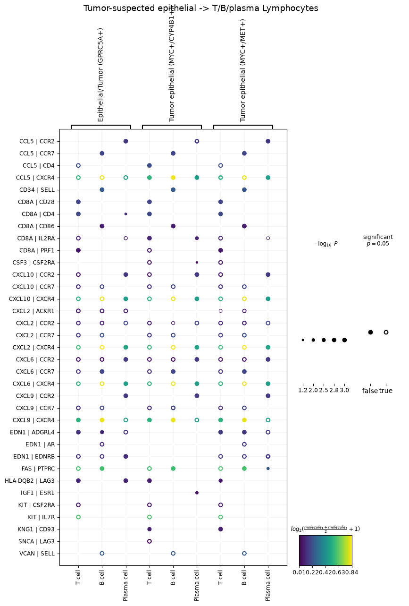
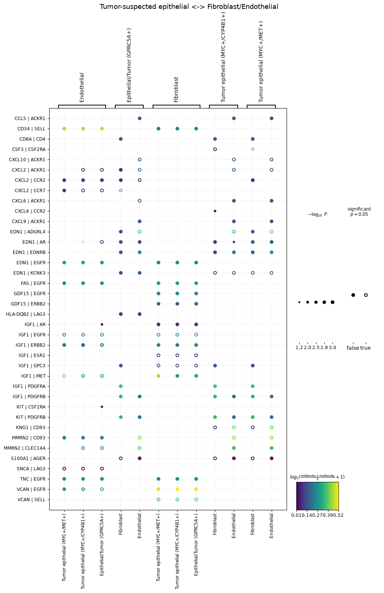

# Spatial-TME-Toolkit

공개 Xenium 공간전사체 데이터 기반 종양 미세환경(TME) 공간 분석 파이프라인

10x Genomics의 공개 폐 선암 Xenium 데이터를 사용하여, 세포 유형 주석부터
공간적 이웃·동시출현 분석, 리간드-수용체 상호작용 분석까지 종양 미세환경
(Tumor Microenvironment, TME)의 공간 구조를 규명하는 재현 가능한 분석
파이프라인을 구현한다. 분석의 각 단계는 재사용 가능한 모듈(`src/`)로 분리하고,
실제 분석 흐름은 노트북(`notebooks/`)에서 확인할 수 있다.

## 데이터 출처

- **플랫폼**: 10x Genomics Xenium In Situ (Xenium Onboard Analysis 2.0.0)
- **조직**: 인체 폐 선암 (Human Lung Adenocarcinoma, FFPE) 단일 섹션
- **패널**: Xenium Human Multi-Tissue and Cancer Panel (377개 유전자)
- **규모**: 162,254 세포 (QC 후 154,469 세포)
- **데이터셋**: [Preview Data: FFPE Human Lung Cancer with Xenium Multimodal Cell Segmentation](https://www.10xgenomics.com/datasets/preview-data-ffpe-human-lung-cancer-with-xenium-multimodal-cell-segmentation-1-standard)
- **라이선스**: Creative Commons Attribution 4.0 International (CC BY 4.0)

> 본 데이터는 예비(preview) 버전의 assay 및 분석 소프트웨어(Xenium Onboard
> Analysis 2.0.0)로 생성되었으며, 향후 최종 워크플로우 데이터로 교체될 수 있다.

## 분석 파이프라인

```
QC (qc.py)
  → Cell-Type Annotation (annotation.py)
    → Neighborhood Enrichment (neighborhood.py)
      → Co-occurrence (neighborhood.py)
        → Ligand-Receptor Interaction (lr_interaction.py)
```

1. **QC**: `spatialdata_io`로 데이터 로딩(대용량 형태학 이미지·transcript 제외),
   control feature(negative probe/codeword) 분리 후 실제 유전자 377개만 유지,
   세포별 QC 지표 계산 후 저품질 세포 필터링(>10 transcripts, >5 genes — 원
   데이터셋 처리 기준과 일치), 라이브러리 사이즈 정규화 및 log1p 변환.
2. **Annotation**: Leiden 클러스터링(14개 클러스터) 후 클러스터별 차별발현유전자
   (`rank_genes_groups`)와 마커 dotplot을 근거로 세포 유형 주석. 대식세포와
   상피/종양 계열은 마커 조합으로 아형까지 세분화.
3. **Neighborhood Enrichment**: `sq.gr.nhood_enrichment`로 세포 유형 간 공간적
   이웃 관계(자기응집 및 상호 배제)를 z-score로 정량화.
4. **Co-occurrence**: `sq.gr.co_occurrence`로 기준 세포 유형으로부터 거리에 따른
   세포 조성 변화 분석. 근거리 해상도 확보를 위해 거리 구간을 명시적으로 지정
   (0–200µm 20µm 간격, 200µm–1mm 100µm 간격, 1mm 이상 500µm 간격).
5. **LR Interaction**: `sq.gr.ligrec`(permutation test)으로 세포 유형 간 유의미한
   (p < 0.05) 리간드-수용체 쌍 탐색. 종양 상피→림프구, 종양 상피↔기질/혈관
   상호작용에 초점.

## 세포 유형 주석 결과

14개 Leiden 클러스터를 마커 근거와 함께 다음과 같이 주석하였다.

| 세포 유형 | 주요 근거 마커 |
| --- | --- |
| T cell | TRAC, CD3E, CD3D, CD2, IL7R |
| B cell | MS4A1, CD79A, CD19, BANK1 |
| Plasma cell | MZB1, TNFRSF17, PRDM1 |
| Alveolar macrophage | MARCO, PPARG, VSIG4, MRC1 |
| Monocyte/Interstitial macrophage | AIF1, MS4A6A, MPEG1 |
| Mast cell | KIT, CPA3, MS4A2, GATA2 |
| Fibroblast | PDGFRA, COL5A2, FBN1, VCAN |
| Endothelial | PECAM1, VWF, CD34, CLEC14A |
| Smooth muscle/Pericyte | MYH11, ACTA2, MYLK, DES |
| Tumor epithelial (MYC+/MET+) | EPCAM, KRT7, MYC, MET |
| Tumor epithelial (MYC+/CYP4B1+) | EPCAM, MYC, CYP4B1 |
| Epithelial/Tumor (GPRC5A+) | EPCAM, GPRC5A, KRT7 |
| Airway epithelial (CYP2B6+/CFTR+) | CYP2B6, CFTR |
| Ciliated epithelial | SNTN, DNAAF1, C20orf85 |

## 핵심 발견: 면역 배제형 미세환경

세 층위의 분석이 하나의 일관된 그림으로 수렴하였다.

**1. 공간 구획화.** 세포 유형을 4개 기능 구역(종양 추정 상피 / 정상형 상피 /
면역 / 기질)으로 압축했을 때, 종양 추정 상피와 정상형 상피가 조직 내에서 서로
다른 영역을 차지하며 공간적으로 분리되었다. Neighborhood enrichment에서도 종양
상피와 정상 기도 상피·T세포 간에 음의 z-score(상호 배제)가 관찰되었다.



*그림 1. 세포 유형을 종양 추정 상피/정상형 상피/면역/기질 4구역으로 압축한 공간 지도
(노트북 2-13).*

**2. 종양 코어의 림프구 배제.** 종양 추정 상피를 기준으로 한 근거리(0–200µm)
동시출현 분석에서, T·B·Plasma 림프구가 종양세포 근접(약 20µm, 세포 1–2개 거리)
구간에서 크게 배제되었고(비율 ≈ 0), 거리가 멀어질수록 서서히 회복되었다. 거리에
따른 회복은 이 패턴이 면역 사막형(desert)이 아닌 **면역 배제형(excluded)**임을
시사한다. 배제 강도는 종양 아형에 따라 달랐으며(MYC+/MET+에서 가장 강함),
B세포가 가장 뚜렷하게 배제되었다.



*그림 2. 종양 추정 상피 3종 각각을 기준으로 한 0–200µm 근거리 co-occurrence 확률비.
T/B/Plasma 림프구만 강조(나머지 세포유형은 회색 배경선), 점선은 baseline(=1) (노트북 3-7).*

**3. 종양-기질 결합과 억제 신호.** LR 분석에서 종양 추정 상피와 기질(fibroblast)·
혈관(endothelial) 사이에 IGF1(→EGFR/ERBB2/PDGFR), EDN1, VCAN|EGFR, TNC|EGFR 등
성장·기질 리모델링 신호가 강하게 나타났다. 반면 종양-림프구 접점에서는 케모카인
(CXCL9/10, CCL5 등)과 함께 억제성 신호(HLA-DQB2|LAG3 등)가 관찰되었다.



*그림 3a. 종양 추정 상피(sender) → T/B/Plasma 림프구(receiver) 방향 유의미한(p<0.05)
리간드-수용체 쌍 (노트북 4-2).*



*그림 3b. 종양 추정 상피 ↔ Fibroblast/Endothelial 양방향 유의미한(p<0.05)
리간드-수용체 쌍 (노트북 4-3).*

이러한 특징은 림프구가 종양 코어에 침투하지 못하고 경계·기질에 머무는 **면역
배제형 미세환경**에 부합한다. 종양-기질이 성장 신호로 긴밀히 결합해 물리적 장벽을
형성하고, 접점의 억제 신호가 림프구 침투를 제한하는 구조로 해석할 수 있다. 이는
면역항암제 반응성이 낮은 종양의 전형적 공간 패턴으로, 치료 전략 관점에서는 기질
장벽을 완화하거나 배제 신호를 차단하는 접근이 필요함을 시사한다.

## English Summary

This repository reproduces a spatial tumor-microenvironment (TME) analysis
pipeline on a public 10x Genomics Xenium human lung adenocarcinoma dataset
(377-gene panel, 162,254 cells). The workflow covers QC, marker-based cell-type
annotation (14 clusters, including macrophage and epithelial/tumor subtypes),
neighborhood enrichment, distance-resolved co-occurrence analysis, and
ligand-receptor interaction analysis (squidpy).

The analyses converge on an **immune-excluded** TME pattern: T, B, and plasma
lymphocytes are strongly depleted within ~20µm of tumor epithelial cells and
recover with distance, while tumor epithelium engages stromal and endothelial
cells through growth and matrix-remodeling signals (IGF1, EDN1, VCAN|EGFR,
TNC|EGFR). Exclusion strength varies by tumor subtype (strongest for MYC+/MET+),
with B cells most strongly excluded. All findings are based on a single tissue
section and are reported as descriptive spatial observations rather than
generalizable conclusions.

## 방법론 한계 (Limitations)

- **단일 섹션 기반 관찰**: 모든 결과는 폐 선암 조직 1개 Xenium 섹션에 대한 관찰이다.
  종양 코어의 림프구 배제, 종양-기질 결합 등의 패턴은 해당 섹션에 한정된 관찰이며,
  환자 집단이나 폐 선암 일반에 대한 결론으로 일반화하지 않는다.
- **종양세포 판정의 근거 수위**: "Tumor epithelial" 라벨은 EPCAM 등 상피 마커와
  MYC/MET 등 오코진 발현, 그리고 정상 상피와의 공간적 분리에 근거한 추정이다.
  악성 여부를 확정하려면 CNV 추론(inferCNV 등) 등 추가 분석이 필요하다.
- **LR 분석의 한계**: (1) 377개 유전자 패널로 구성 가능한 쌍에 한정되어 다수의
  실제 LR 쌍이 평가되지 않았다. (2) `ligrec`은 발현 기반 permutation 검정으로,
  공간적 근접성을 직접 고려하지 않으며 리간드-수용체의 발현 공존이 실제 물리적
  상호작용을 보장하지 않는다. 따라서 공간(co-occurrence)과 발현(LR) 근거를 별도로
  제시하고, 둘을 종합해 가설을 세우는 방식으로 해석하였다.
- **"면역 배제형" 해석의 범위**: 본 분석은 면역 배제형에 부합하는 공간·발현
  패턴을 관찰한 것이며, 병리학적 검증(예: 면역염색)이 동반된 확정 진단은 아니다.
  배제의 원인(기질 장벽 대 억제 신호)은 가설 수준이다.
- **마커 기반 주석의 주관성**: 마커 유전자 세트 및 클러스터링 resolution 선택에
  따라 세포 유형 분류 결과가 달라질 수 있다.

## 향후 계획 (Planned Extensions)

- **Niche 정의**: 국소 세포 조성 기반 클러스터링으로 공간적 니치를 정량 정의.
- **Visium 확장**: 동일 분석 논리를 스팟 기반 Visium 종양 데이터에 적용해 플랫폼
  간 비교(단일세포 해상도 vs 스팟 기반, deconvolution 포함).
- **CNV 추론**: inferCNV 등으로 종양세포 판정 근거 강화.

## 환경 및 재현

- Python 3.11, scanpy, squidpy, spatialdata, spatialdata-io, anndata
- 환경 구성: `environment.yml` 참조