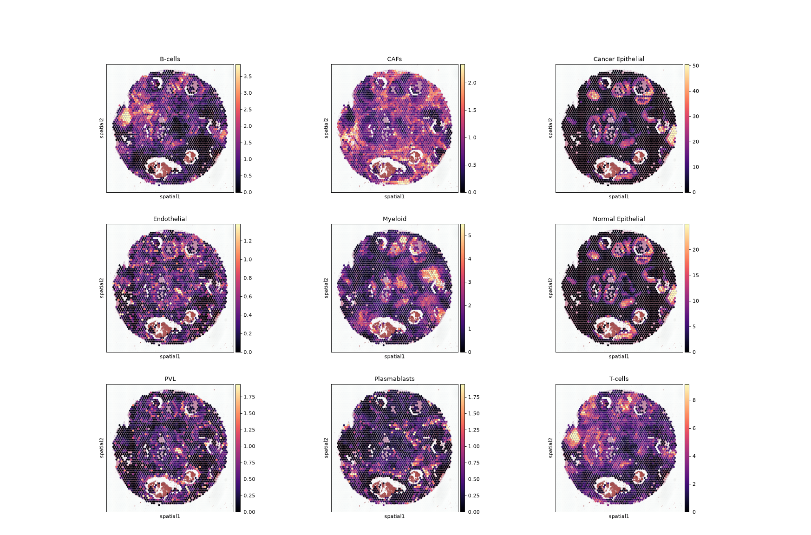
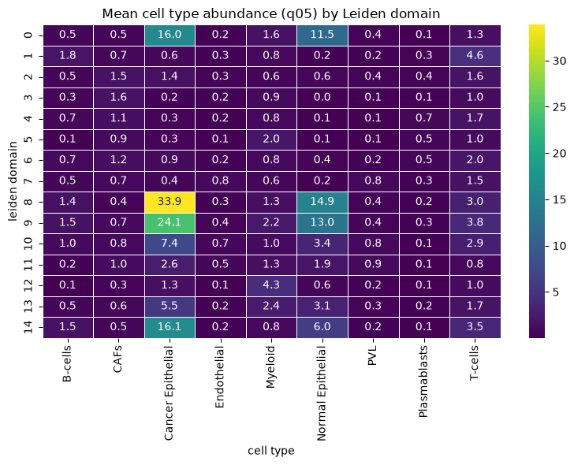
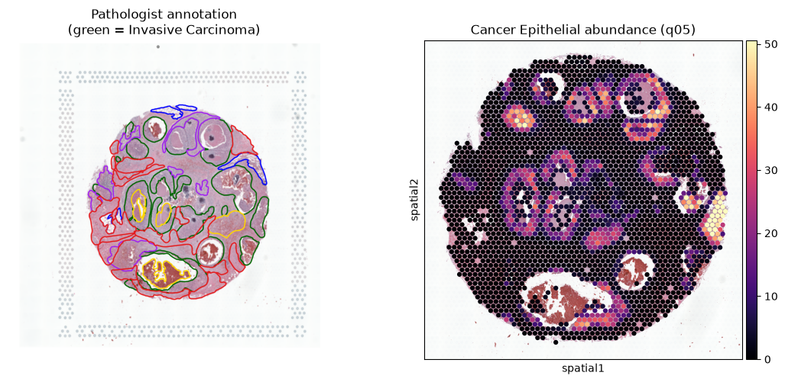
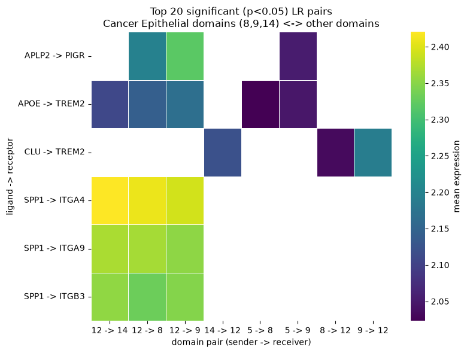

# Spatial-TME-Toolkit

공개 Xenium 공간전사체 데이터 기반 종양 미세환경(TME) 공간 분석 파이프라인

10x Genomics의 공개 폐 선암 Xenium 데이터를 사용하여, 세포 유형 주석부터
공간적 이웃·동시출현 분석, 리간드-수용체 상호작용 분석까지 종양 미세환경
(Tumor Microenvironment, TME)의 공간 구조를 규명하는 재현 가능한 분석
파이프라인을 구현한다. 분석의 각 단계는 재사용 가능한 모듈(`src/`)로 분리하고,
실제 분석 흐름은 노트북(`notebooks/`)에서 확인할 수 있다.

## 데이터 출처

- **플랫폼**: 10x Genomics Xenium In Situ (Xenium Onboard Analysis 2.0.0)
- **조직**: 인체 폐 선암 (Human Lung Adenocarcinoma, FFPE) 단일 섹션
- **패널**: Xenium Human Multi-Tissue and Cancer Panel (377개 유전자)
- **규모**: 162,254 세포 (QC 후 154,469 세포)
- **데이터셋**: [Preview Data: FFPE Human Lung Cancer with Xenium Multimodal Cell Segmentation](https://www.10xgenomics.com/datasets/preview-data-ffpe-human-lung-cancer-with-xenium-multimodal-cell-segmentation-1-standard)
- **라이선스**: Creative Commons Attribution 4.0 International (CC BY 4.0)

> 본 데이터는 예비(preview) 버전의 assay 및 분석 소프트웨어(Xenium Onboard
> Analysis 2.0.0)로 생성되었으며, 향후 최종 워크플로우 데이터로 교체될 수 있다.

## 분석 파이프라인

```
QC (qc.py)
  → Cell-Type Annotation (annotation.py)
    → Neighborhood Enrichment (neighborhood.py)
      → Co-occurrence (neighborhood.py)
        → Ligand-Receptor Interaction (lr_interaction.py)
```

1. **QC**: `spatialdata_io`로 데이터 로딩(대용량 형태학 이미지·transcript 제외),
   control feature(negative probe/codeword) 분리 후 실제 유전자 377개만 유지,
   세포별 QC 지표 계산 후 저품질 세포 필터링(>10 transcripts, >5 genes — 원
   데이터셋 처리 기준과 일치), 라이브러리 사이즈 정규화 및 log1p 변환.
2. **Annotation**: Leiden 클러스터링(14개 클러스터) 후 클러스터별 차별발현유전자
   (`rank_genes_groups`)와 마커 dotplot을 근거로 세포 유형 주석. 대식세포와
   상피/종양 계열은 마커 조합으로 아형까지 세분화.
3. **Neighborhood Enrichment**: `sq.gr.nhood_enrichment`로 세포 유형 간 공간적
   이웃 관계(자기응집 및 상호 배제)를 z-score로 정량화.
4. **Co-occurrence**: `sq.gr.co_occurrence`로 기준 세포 유형으로부터 거리에 따른
   세포 조성 변화 분석. 근거리 해상도 확보를 위해 거리 구간을 명시적으로 지정
   (0–200µm 20µm 간격, 200µm–1mm 100µm 간격, 1mm 이상 500µm 간격).
5. **LR Interaction**: `sq.gr.ligrec`(permutation test)으로 세포 유형 간 유의미한
   (p < 0.05) 리간드-수용체 쌍 탐색. 종양 상피→림프구, 종양 상피↔기질/혈관
   상호작용에 초점.

## 세포 유형 주석 결과

14개 Leiden 클러스터를 마커 근거와 함께 다음과 같이 주석하였다.

| 세포 유형 | 주요 근거 마커 |
| --- | --- |
| T cell | TRAC, CD3E, CD3D, CD2, IL7R |
| B cell | MS4A1, CD79A, CD19, BANK1 |
| Plasma cell | MZB1, TNFRSF17, PRDM1 |
| Alveolar macrophage | MARCO, PPARG, VSIG4, MRC1 |
| Monocyte/Interstitial macrophage | AIF1, MS4A6A, MPEG1 |
| Mast cell | KIT, CPA3, MS4A2, GATA2 |
| Fibroblast | PDGFRA, COL5A2, FBN1, VCAN |
| Endothelial | PECAM1, VWF, CD34, CLEC14A |
| Smooth muscle | MYH11, ACTA2, MYLK, DES |
| Tumor epithelial (MYC+/MET+) | EPCAM, KRT7, MYC, MET |
| Tumor epithelial (MYC+/CYP4B1+) | EPCAM, MYC, CYP4B1 |
| Epithelial/Tumor (GPRC5A+) | EPCAM, GPRC5A, KRT7 |
| Airway epithelial (CYP2B6+/CFTR+) | CYP2B6, CFTR |
| Ciliated epithelial | SNTN, DNAAF1, C20orf85 |

## 핵심 발견: 면역 배제형(Immune-excluded) 종양 미세환경

공간 구획화, 근거리 동시출현, 리간드-수용체 세 가지 분석에서 공통된 경향이 나타났다.

**1. 공간 구획화.** 세포 유형을 4개 기능 구역(Tumor-suspect epithelial / Normal-like epithelium /
Immune / Stroma)으로 압축했을 때, Tumor-suspect epithelial와 Normal-like epithelium가 조직 내에서 서로
다른 영역을 차지하며 공간적으로 분리되었다. Neighborhood enrichment에서도 Tumor epithelial와 Airway epithelial·T cell 간에 음의 z-score(상호 배제)가 관찰되었다.


*그림 1. 세포 유형을 Tumor-suspect epithelial/Normal-like epithelium/Immune/Stroma 4구역으로 압축한 공간 지도
(노트북 2-13).*

**2. 종양 코어의 림프구 배제.** Tumor epithelial를 기준으로 한 근거리(0–200µm)
동시출현 분석에서, T·B·Plasma 림프구가 종양세포 근접(약 20µm, 세포 1–2개 거리)
구간에서 크게 배제되었고(비율 ≈ 0), 거리가 멀어질수록 서서히 회복되었다. 거리에
따른 회복은 이 패턴이 면역 사막형(immune-desert)이 아니라 **면역 배제형**에
가까움을 보여준다. 배제 강도는 종양 아형에 따라 달랐으며(MYC+/MET+에서 가장 강함),
B세포가 가장 뚜렷하게 배제되었다.


*그림 2. Tumor epithelial 3종 각각을 기준으로 한 0–200µm 근거리 co-occurrence 확률비.
T/B/Plasma 림프구만 강조(나머지 세포유형은 회색 배경선), 점선은 baseline(=1) (노트북 3-7).*

**3. Tumor-Stroma 결합과 억제 신호.** LR 분석에서 Tumor epithelial와 Stroma(fibroblast)·
혈관(endothelial) 사이에 IGF1(→EGFR/ERBB2/PDGFR), EDN1, VCAN|EGFR, TNC|EGFR 등
성장·기질 리모델링 신호가 강하게 나타났다. 반면 종양-림프구 접점에서는 케모카인
(CXCL9/10, CCL5 등)과 함께 억제성 신호(HLA-DQB2|LAG3 등)가 관찰되었다.


*그림 3a. Tumor epithelial(sender) → T/B/Plasma 림프구(receiver) 방향 유의미한(p<0.05)
리간드-수용체 쌍 (노트북 4-2).*


*그림 3b. Tumor epithelial ↔ Fibroblast/Endothelial 양방향 유의미한(p<0.05)
리간드-수용체 쌍 (노트북 4-3).*

이러한 특징은 림프구가 종양 코어에 침투하지 못하고 경계·기질에 머무는 **면역 배제형
종양 미세환경**과 부합한다. Tumor-Stroma는 성장 신호로 결합되어 있고, 접점의 억제
신호가 림프구 침투를 제한하는 구조로 해석할 수 있다. 이는 면역항암제 반응성이 낮은
종양에서 보고되는 공간 패턴과 유사하며, 치료 전략 관점에서는 기질 장벽을 완화하거나
배제 신호를 차단하는 접근을 고려할 수 있다.

## Visium 확장: 유방암 FFPE 데이터

Xenium과 동일한 분석 논리를 스팟 기반 Visium 종양 데이터에 적용해 플랫폼 간 차이를
비교했다. 노트북: `notebooks/visium_analysis.ipynb`(QC~클러스터링),
`notebooks/visium_deconvolution.ipynb`(deconvolution~LR).

### 데이터 개요

- **플랫폼**: 10x Genomics Visium (표준 55µm spot, FFPE probe-based whole transcriptome)
- **조직**: 인체 유방암 (Ductal Carcinoma In Situ + Invasive Carcinoma, FFPE)
- **규모**: 2,518 spots, 17,943 유전자 (QC 후 2,388 spots)
- **데이터셋**: [Human Breast Cancer: Ductal Carcinoma In Situ, Invasive Carcinoma (FFPE)](https://www.10xgenomics.com/datasets/human-breast-cancer-ductal-carcinoma-in-situ-invasive-carcinoma-ffpe-1-standard-1-3-0)
- **Deconvolution 참조**: Wu et al. 2021 유방암 scRNA-seq atlas (`celltype_major` 9종:
  B-cells, CAFs, Cancer Epithelial, Endothelial, Myeloid, Normal Epithelial, PVL,
  Plasmablasts, T-cells)

### Xenium과 다른 전처리

Visium spot은 55µm 지름 안에 여러 세포가 섞여 있는 다세포 혼합 단위이고(Xenium은
단일세포 해상도), whole transcriptome을 측정하므로(Xenium은 377개 타깃 패널) 전처리
방식이 다르다.

- **미토콘드리아 유전자 QC**: `MT-` 접두어 유전자로 `pct_counts_mt`를 계산했으나 전
  스팟에서 0으로 나왔다. 이 probe-based whole-transcriptome panel(17,943개 probe)이
  애초에 미토콘드리아 유전자를 포함하지 않기 때문(표기 문제가 아님을 심볼·Ensembl ID
  양쪽으로 확인). Fresh-frozen polyA 캡처 기반 Visium과의 차이다.
- **HVG 선택**: whole transcriptome이라 Xenium에는 없던 단계. `highly_variable_genes`로
  2,000개 선택 후 PCA에 사용.
- **QC 필터링**: 분위수 분포를 먼저 확인한 뒤 `MIN_COUNTS=3000`, `MIN_GENES=2000`
  (약 5%ile) 컷오프로 130개 스팟(5.2%) 제거.

### 공간 도메인 클러스터링

Xenium의 leiden 클러스터는 세포 유형에 대응했지만, Visium spot은 다세포 혼합이므로
동일한 방식(HVG 기반 PCA → neighbors → leiden)으로 얻은 15개 클러스터는 "세포 유형"이
아니라 **공간 도메인**(비슷한 세포 조성을 공유하는 조직 영역)으로 해석했다.

### Cell2location Deconvolution

Wu et al. 2021 참조로 학습한 `RegressionModel` 시그니처(`celltype_major` 9종)를
`Cell2location`에 입력해 스팟별 세포유형 조성(q05 posterior)을 추정했다.



*그림 4. 스팟별 9종 세포유형 abundance(q05)의 공간 분포. Cancer/Normal Epithelial이
duct/gland 형태의 링 구조를 따라 뚜렷하게 국한된다 (`visium_deconvolution.ipynb` 6-7).*

Leiden 공간 도메인별 평균 조성을 대조한 결과, 도메인 8/9/14가 Cancer Epithelial
우세(abundance 최대 33.9)로 나타나 서로 독립적인 두 방법(발현 기반 클러스터링 vs
참조 시그니처 기반 회귀)이 일관된 그림을 보였다.



*그림 5. Leiden 공간 도메인별 평균 세포유형 abundance(q05) 히트맵 (`visium_deconvolution.ipynb` 7-1~7-4).*

### 병리 주석 검증

10x 공식 병리학자 주석(Fat/Fibrous Tissue/Immune Cells/Invasive Carcinoma/Necrosis)과
Cancer Epithelial abundance를 육안으로 대조했다. 이미지 간 정밀한 픽셀 좌표 정합
(registration)은 하지 않은 정성적 비교다.



*그림 6. 병리학자 주석(Invasive Carcinoma=초록)과 Cancer Epithelial abundance 공간
분포 비교. 둘 다 duct/gland 링 구조 주변에 신호가 집중되는 공통 패턴을 보이나, 병리
주석은 조직 형태학 기준의 넓은 연속 영역인 반면 deconvolution은 스팟 단위 세포 조성
추정치라 완전히 일치하지는 않는다 (`visium_deconvolution.ipynb` 6-7 이어서).*

### 도메인 기반 LR 분석

Visium은 다세포 혼합이라 세포 유형 간 직접 LR을 볼 수 없어, leiden 공간 도메인을
그룹으로 사용하고 도메인의 우세 조성을 해석 근거로 삼았다. Myeloid 우세 도메인(12)과
Cancer Epithelial 우세 도메인(8/9/14) 사이에서 종양연관대식세포(TAM) 관련 신호축이
확인되었다: **SPP1 → ITGA4/ITGA9/ITGB3**(osteopontin-integrin), **APOE/CLU → TREM2**
(lipid-associated macrophage 마커 인식).



*그림 7. Cancer Epithelial 우세 도메인(8,9,14) ↔ 그 외 도메인 간 유의미한(p<0.05)
상위 리간드-수용체 쌍 (`visium_deconvolution.ipynb` 8장).*

### Xenium vs Visium 비교

| | Xenium | Visium |
| --- | --- | --- |
| 공간 해상도 | 단일세포 | spot (55µm, 다세포 혼합) |
| 유전자 수 | 377개 (타깃 패널) | 17,943개 (whole transcriptome) |
| 세포 유형 처리 | leiden 클러스터 = 세포 유형 (직접 주석) | leiden 클러스터 = 공간 도메인 + deconvolution으로 세포 조성 추정 |
| HVG 선택 | 불필요 (타깃 패널 전체 사용) | 필요 (2,000개 선택) |
| LR 분석 단위 | 세포 유형 간 직접 | 공간 도메인 간 (도메인 우세 조성으로 해석 보강) |

## English Summary

This repository reproduces a spatial tumor-microenvironment (TME) analysis
pipeline on a public 10x Genomics Xenium human lung adenocarcinoma dataset
(377-gene panel, 162,254 cells). The workflow covers QC, marker-based cell-type
annotation (14 clusters, including macrophage and epithelial/tumor subtypes),
neighborhood enrichment, distance-resolved co-occurrence analysis, and
ligand-receptor interaction analysis (squidpy).

The analyses converge on an **immune-excluded** TME pattern: T, B, and plasma
lymphocytes are strongly depleted within ~20µm of tumor epithelial cells and
recover with distance, while tumor epithelium engages stromal and endothelial
cells through growth and matrix-remodeling signals (IGF1, EDN1, VCAN|EGFR,
TNC|EGFR). Exclusion strength varies by tumor subtype (strongest for MYC+/MET+),
with B cells most strongly excluded.

The same analytical logic was extended to a standard 55µm-spot Visium human
breast cancer FFPE dataset (2,518 spots, whole-transcriptome probe panel).
Because each Visium spot mixes multiple cells and captures the whole
transcriptome rather than a targeted panel, preprocessing differs from Xenium
in several ways: highly-variable-gene selection is required, and
mitochondrial-gene QC does not apply, since this FFPE probe panel excludes
mitochondrial genes entirely. Leiden clusters on spot data were treated as
spatial domains rather than cell types. Spot-level cell-type composition was
estimated with cell2location, using a reference derived from the Wu et al.
(2021) breast cancer scRNA-seq atlas (9 major cell types), and checked
qualitatively against the official pathologist annotation. Domain-level
ligand-receptor analysis identified a tumor-associated-macrophage signaling
axis (SPP1-integrin, APOE/CLU-TREM2) between myeloid-dominant and
cancer-epithelial-dominant domains.

Across both platforms, the tumor engages specific immune and stromal
populations, though the resolution at which this can be established differs:
Xenium supports direct cell-type-level interpretation, while Visium's
multicellular spots require domain-level inference supported by
deconvolution. All findings are based on a single tissue section per platform
and are reported as descriptive spatial observations rather than
generalizable conclusions.

## 방법론 한계 (Limitations)

- **단일 섹션 기반 관찰**: 모든 결과는 폐 선암 조직 1개 Xenium 섹션에 대한 관찰이다.
  종양 코어의 림프구 배제, Tumor-Stroma 결합 등의 패턴은 해당 섹션에 한정된 관찰이며,
  환자 집단이나 폐 선암 일반에 대한 결론으로 일반화하지 않는다.
- **종양세포 판정의 근거 수위**: "Tumor epithelial" 라벨은 EPCAM 등 상피 마커와
  MYC/MET 등 오코진 발현, 그리고 정상 상피와의 공간적 분리에 근거한 추정이다.
  악성 여부를 확정하려면 CNV 추론(inferCNV 등) 등 추가 분석이 필요하다.
- **(Xenium) LR 분석의 한계**: (1) 377개 유전자 패널로 구성 가능한 쌍에 한정되어 다수의
  실제 LR 쌍이 평가되지 않았다. (2) `ligrec`은 발현 기반 permutation 검정으로,
  공간적 근접성을 직접 고려하지 않으며 리간드-수용체의 발현 공존이 실제 물리적
  상호작용을 보장하지 않는다. 따라서 공간(co-occurrence)과 발현(LR) 근거를 별도로
  제시하고, 둘을 종합해 가설을 세우는 방식으로 해석하였다.
- **"면역 배제형" 해석의 범위**: 본 분석은 면역 배제형에 부합하는 공간·발현
  패턴을 관찰한 것이며, 병리학적 검증(예: Immunostaining)이 동반된 확정 진단은 아니다.
  배제의 원인(기질 장벽 대 억제 신호)은 가설 수준이다.
- **마커 기반 주석의 주관성**: 마커 유전자 세트 및 클러스터링 resolution 선택에
  따라 세포 유형 분류 결과가 달라질 수 있다.
- **(Visium) 스팟 혼합으로 발신 세포 특정 불가**: spot은 다세포 혼합 단위이므로,
  leiden 공간 도메인 간에 관찰된 LR 신호가 실제로 어떤 세포 유형 쌍 사이의 신호인지
  직접 특정할 수 없다. 도메인의 우세 조성(deconvolution 기준)으로 정황을 보강했을 뿐,
  Xenium처럼 "세포 유형 A → 세포 유형 B"로 확정할 수 있는 증거는 아니다.
- **(Visium) Deconvolution의 참조 의존성**: cell2location 결과는 Wu et al. 2021
  참조 scRNA-seq(다른 환자·다른 시퀀싱 기술)에 의존한다. 참조와 본 샘플 사이의
  배치 효과(batch effect), 참조에 없는 세포 상태·아형은 결과에 반영되지 않는다.
- **(Visium) 병리 주석 대조는 정량 정합이 아닌 육안 수준**: 병리 주석 이미지와
  Space Ranger 출력 이미지 사이의 정확한 픽셀 scale factor가 없어 좌표 기반 정합
  (image registration)을 하지 않았다. 두 그림을 나란히 놓고 병변 위치가 대략
  일치하는지 확인한 정성적 비교이며, 정량적 검증(예: IoU, correlation)은 아니다.

## 향후 계획 (Planned Extensions)

- **Niche 정의**: 국소 세포 조성 기반 클러스터링으로 공간적 니치를 정량 정의.
- **CNV 추론**: inferCNV 등으로 종양세포 판정 근거 강화.

## 환경 및 재현

- Python 3.11, scanpy, squidpy, spatialdata, spatialdata-io, anndata
- Visium deconvolution 추가 의존성: cell2location, scvi-tools, torch (GPU)
- 환경 구성: `environment.yml` 참조